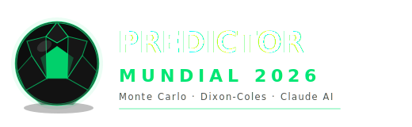

<div align="center">



<br/>

**Simulador de partidos del Mundial FIFA 2026 con IA y estadística avanzada**

<br/>

[](https://nextjs.org)
[](https://react.dev)
[](https://www.typescriptlang.org)
[](https://anthropic.com)
[](https://tailwindcss.com)
[](https://vercel.com)

<br/>


</div>

---

## Descripción

Mundial 2026 Predictor es una app web que combina simulación estadística con búsqueda de datos en tiempo real para predecir resultados de partidos del Mundial FIFA 2026. Usa el modelo Dixon-Coles con distribución de Poisson bivariada para estimar goles esperados (xG), calibrado con información actual que Claude busca en la web antes de cada simulación. Corre 300.000 iteraciones Monte Carlo por partido y presenta los resultados con probabilidades, mercados de apuestas y análisis narrativo.

---

## Funcionalidades

| Módulo | Descripción |
|--------|-------------|
| **Selección de equipos** | Dropdowns con los 48 equipos oficiales del Mundial 2026, organizados por grupo |
| **Fase de grupos** | Filtra enfrentamientos válidos: solo equipos del mismo grupo pueden verse las caras |
| **Fases eliminatorias** | Cualquier equipo contra cualquier equipo, con indicador de grupo de origen |
| **Búsqueda web con IA** | Claude busca datos reales (forma reciente, bajas, contexto del partido) antes de simular |
| **Simulación Monte Carlo** | 300.000 partidos simulados por consulta usando modelo Dixon-Coles + Poisson bivariado |
| **Resultados más probables** | Top scores con probabilidad individual y cobertura acumulada del top-3 |
| **Mercados de probabilidad** | Victoria local / empate / victoria visitante, ambos anotan, +2.5 goles, etc. |
| **Capas de predicción** | Resultado seguro vs. resultado probable con nivel de confianza |
| **Análisis narrativo** | Recomendación textual generada por Claude con contexto táctico |
| **Historial local** | Últimas 5 simulaciones persistidas en `localStorage`, recargables con un clic |
| **Compartir análisis** | Copia al portapapeles un resumen formateado listo para WhatsApp o redes |
| **Loading progresivo** | 4 pasos animados que reflejan el estado real del proceso |

---

## Paleta de colores

<div align="center">


</div>

---

## Stack

### Frontend / Full-stack

| | Tecnología | Rol |
|---|---|---|
|  | **Next.js 16** | Framework full-stack con App Router |
|  | **React 19** | UI y estado local |
|  | **TypeScript 5** | Tipado estático end-to-end |
|  | **TailwindCSS 4** | Estilos utility-first |
|  | **Recharts** | Gráficos de probabilidad |

### IA y estadística

| | Tecnología | Rol |
|---|---|---|
|  | **@anthropic-ai/sdk** | Búsqueda web en tiempo real + análisis narrativo |
| | **Dixon-Coles** | Modelo de predicción de goles con corrección de empates 0-0 y 1-0 |
| | **Poisson Bivariado** | Distribución de probabilidad para goles de cada equipo |
| | **Monte Carlo** | 300.000 simulaciones por partido para construir distribución de resultados |

### Infraestructura

| | Tecnología | Rol |
|---|---|---|
|  | **Vercel** | Deploy automático desde `main`, serverless functions para la API |
|  | **GitHub** | Control de versiones, CI/CD via Vercel integration |

---

## Estructura del proyecto

```
mundial-2026-predictor/
├── app/
│   ├── api/
│   │   └── simulate/
│   │       └── route.ts         # API route: llama a Claude + corre simulación
│   ├── globals.css
│   ├── layout.tsx
│   └── page.tsx                 # UI principal: form, loading, resultados, historial
├── components/
│   ├── MatchForm.tsx            # Selección de equipos, grupo y fase con validación
│   ├── SimulationResults.tsx    # Vista completa de resultados
│   ├── ProbabilityChart.tsx     # Gráfico de barras con top resultados
│   ├── ScoresGrid.tsx           # Grilla de scores más probables
│   ├── MarketsTable.tsx         # Tabla de mercados (1X2, BTTS, +2.5, etc.)
│   └── ConfidenceBadge.tsx      # Badge de nivel de confianza
├── lib/
│   ├── grupos.ts                # 48 equipos organizados en 12 grupos (A-L)
│   ├── poisson.ts               # Implementación Dixon-Coles + Monte Carlo
│   ├── prompts.ts               # Prompts para Claude (búsqueda + análisis)
│   └── insights.ts              # Capas de predicción y lógica narrativa
├── types/
│   └── simulation.ts            # Tipos TypeScript compartidos
├── assets/
│   └── logo.svg
└── public/
```

---

## Modelo estadístico

El predictor usa el modelo **Dixon-Coles** (1997) con las siguientes etapas:

```
1. Claude busca en la web
   └── forma reciente, lesiones, estadísticas head-to-head, contexto de fase

2. Calibración de parámetros xG
   └── λ (goles esperados local) y μ (goles esperados visitante)
   └── ajustados por ventaja de local y contexto táctico ingresado

3. Distribución Poisson Bivariada
   └── P(X=i, Y=j) con corrección Dixon-Coles para (0,0) y (1,0)
   └── elimina la subestimación de empates bajos en Poisson independiente

4. Simulación Monte Carlo (300.000 iteraciones)
   └── construye distribución empírica de todos los scorelines posibles
   └── agrega resultados en mercados: 1X2, BTTS, O/U 2.5, etc.

5. Análisis narrativo
   └── Claude interpreta los números con contexto y genera recomendación
```

---

## Variables de entorno

| Variable | Descripción |
|----------|-------------|
| `ANTHROPIC_API_KEY` | API key de Anthropic (Claude) — requerida |

---

## Desarrollo local

### Requisitos


### 1. Clonar e instalar
```bash
git clone https://github.com/pabloisaac/prode-predictor.git
cd prode-predictor
npm install
```

### 2. Variables de entorno
```bash
# Crear .env.local y agregar:
ANTHROPIC_API_KEY=sk-ant-...
```

### 3. Iniciar en modo desarrollo
```bash
npm run dev
# App: http://localhost:3000
```

---

## Scripts disponibles

```bash
npm run dev       # Servidor de desarrollo con hot reload
npm run build     # Build de producción
npm run start     # Servidor de producción local
```

---

## Grupos del Mundial 2026

Los 48 equipos distribuidos en 12 grupos:

| Grupo | Equipos |
|-------|---------|
| **A** | México · Sudáfrica · Corea del Sur · República Checa |
| **B** | Canadá · Bosnia y Herzegovina · Catar · Suiza |
| **C** | Brasil · Marruecos · Haití · Escocia |
| **D** | Estados Unidos · Paraguay · Australia · Turquía |
| **E** | Alemania · Curazao · Costa de Marfil · Ecuador |
| **F** | Países Bajos · Japón · Suecia · Túnez |
| **G** | Bélgica · Egipto · Irán · Nueva Zelanda |
| **H** | España · Cabo Verde · Arabia Saudita · Uruguay |
| **I** | Francia · Senegal · Irak · Noruega |
| **J** | Argentina · Argelia · Austria · Jordania |
| **K** | Portugal · Rep. Dem. del Congo · Uzbekistán · Colombia |
| **L** | Inglaterra · Croacia · Ghana · Panamá |

---

<div align="center">


<br/>

*Desarrollado con ♥ para el **Mundial FIFA 2026***

</div>
